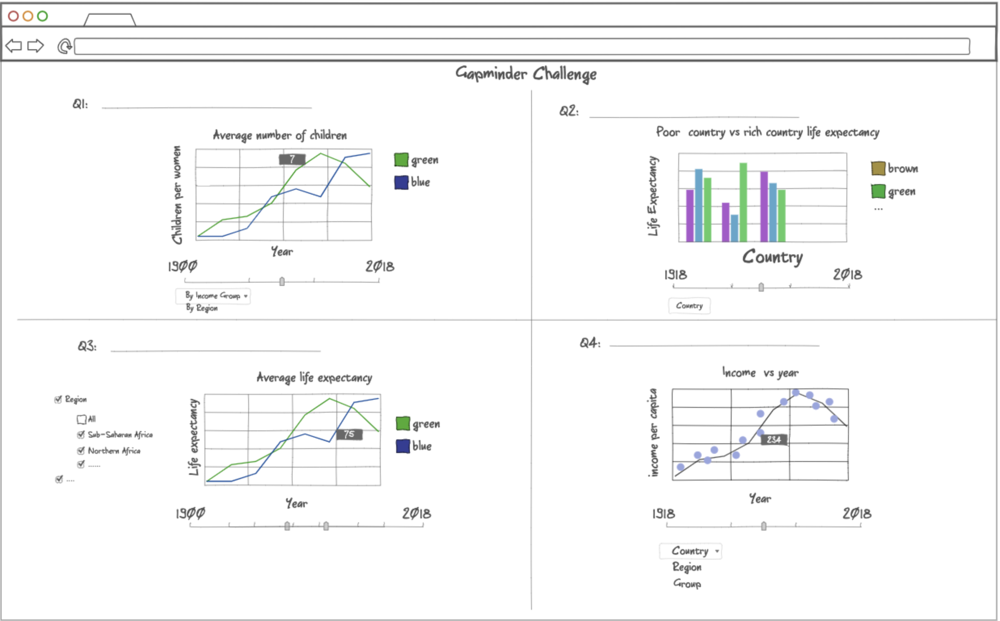

# gapminder_challenge

Package for Data Visualization

## App Description

Our app features a single page that hosts four interactive data visualization plots by a 2 by 2 layout. Each plot is associated with one question that evaluates the users' understanding of global development since 1900s. The topics include child birth rate, child mortality vs. income level, average life expectancy, and income per capita. Each plot has its own controls, such as sliders for year range and drop-down menus for country, region, and income group selections. These components allow the users to explore and manipulate the data supporting the answers to the questions, offering a dynamic and enriched learning experience.

Here is an example sketch of the app:



## Installation

```bash
TODO
```

## Usage

- TODO

## Contributing

Interested in contributing? Check out the contributing guidelines. Please note that this project is released with a Code of Conduct. By contributing to this project, you agree to abide by its terms.

## License

`gapminder_challenge` was created by DSCI532_Group12. It is licensed under the terms of the MIT license.

## Credits

`gapminder_challenge` was created with [`cookiecutter`](https://cookiecutter.readthedocs.io/en/latest/) and the `py-pkgs-cookiecutter` [template](https://github.com/py-pkgs/py-pkgs-cookiecutter).
